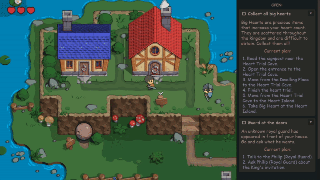

# LibMozok Godot DEMO

**LibMozok** is a universal quest engine for games. It implements a system heavily inspired by ["Hierarchical generation of dynamic and nondeterministic quests in games"](https://www.researchgate.net/publication/286454232_Hierarchical_Generation_of_Dynamic_and_Nondeterministic_Quests_in_Games).

This demo illustrates how LibMozok can be integrated with Godot. 
The game and its art style are inspired by the 2D Legend of Zelda games.

*Mozok, derived from the Ukrainian word "мозок" meaning "brain."*

# Showcase

LibMozok generates a plan for a quest in real-time and detects when the quest becomes unsolvable: 

[YouTube - Trailer](https://www.youtube.com/watch?v=PGk74Lz8u0I) 
[YouTube - Tutorial (full demo)](https://www.youtube.com/watch?v=g42drEw9XuY) 
[YouTube - New Game (full demo)](https://www.youtube.com/watch?v=CjTnomcOVsc)

    
More...

    The same quest, but successfully solved this time: 
     
    From the demo: 
     
     
    

# How to Run the DEMO Project

## Prerequisites

1. C/C++ Compiler
2. CMake 3.22 or newer
3. SCons
4. Godot 4.3 or newer
5. git
6. Enable Git LFS

## Installation

1. Create and go into a working dir (this folder will be referred as `[WorkDir]`).
2. Download the **libmozok** [repository](https://github.com/zegalur/libmozok) (will be in `[WorkDir]/libmozok`): 
`git clone https://github.com/zegalur/libmozok.git`
3. Download the **libmozok-godot** [repository](https://github.com/zegalur/libmozok-godot) (will be in `[WorkDir]/libmozok-godot`): 
`git clone https://github.com/zegalur/libmozok-godot.git`
4. Build and install **libmozok**:
    1. Follow the libmozok installation instructions: 
    [https://github.com/zegalur/libmozok?tab=readme-ov-file#installation](https://github.com/zegalur/libmozok?tab=readme-ov-file#installation)
    2. You should now have the non-empty `lib/` and `include/libmozok/` directories inside the `install` directory.
6. Build and install the `libmozok-godot` GDExtension:
    1. Navigate to the repository:  
    `cd [WorkDir]/libmozok-godot`

    2. (Initialize a Git repository if needed: `git init`)

    3. (Add the Godot C++ bindings as a submodule if needed:  
    `git submodule add -b 4.4 https://github.com/godotengine/godot-cpp`)

    4. Navigate to the Godot C++ bindings directory:  
    `cd godot-cpp`

    5. Update and initialize the submodule: 
    `git submodule update --init`

    6. Build the Godot C++ bindings:   
    `scons platform=<platform>` (**platform** is `windows`, `linux`, or `macos`)

    7. Return to the **libmozok-godot** directory:  
    `cd ..`

    8. Build the release version:  
    `scons platform=<platform> target=template_release`

    9. Build the debug version:  
    `scons platform=<platform>`

    10. You should now have the `libgdmozok` library files in `[WorkDir]/libmozok-godot/demo/bin`
    
    11. Open the `gdmozok.gdextension` file in the `demo/bin` directory and ensure that the library file names match.
7. Open the DEMO project from `[WorkDir]/libmozok-godot/demo` in Godot. 
8. If you encounter **"Load Errors"** messages, close the editor and reopen the project. Normally, there should be no errors after reloading the editor.
9. Run the DEMO.

# References

* Soares de Lima, Edirlei & Feijó, Bruno & Furtado, Antonio. (2014). *Hierarchical Generation of Dynamic and Nondeterministic Quests in Games.* ACM International Conference Proceeding Series. 2014. 10.1145/2663806.2663833. Web. https://www.researchgate.net/publication/286454232_Hierarchical_Generation_of_Dynamic_and_Nondeterministic_Quests_in_Games

# License

LibMozok is subject to the MIT license. 
All other assets created for this demo are under CC0.

Created by Pavlo Savchuk, 2024-2025.
